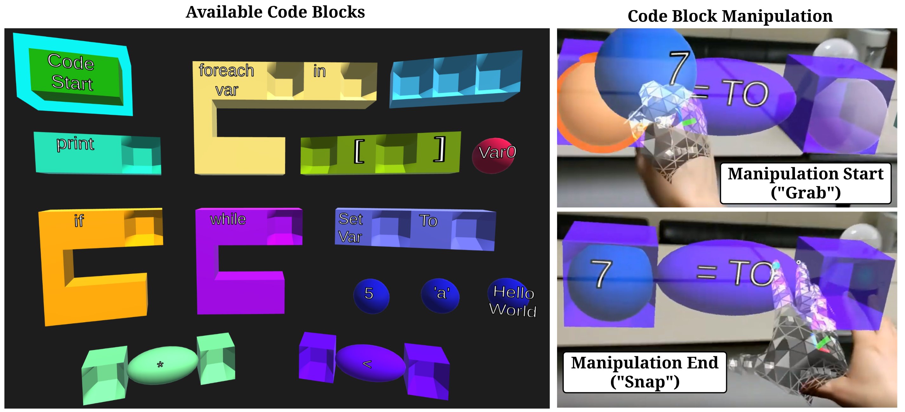
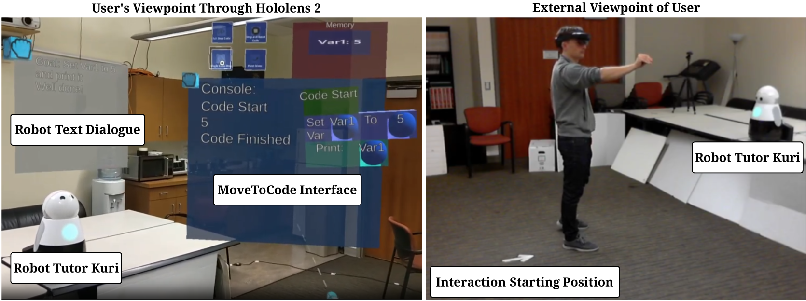

# MoveToCode: A Mixed Reality Visual Programming Language


MoveToCode is an open source mixed reality visual programming language (VPL) created by the [Interaction Lab](http://robotics.usc.edu/interaction/) led by [Maja J Matric](https://robotics.usc.edu/~maja/index.html). The VPL is used to study [student kinesthetic curiostiy](https://tgroechel.github.io/kin_cur.html).  The VPL can be thought of similar to [Scratch](https://scratch.mit.edu/) in 3D. 

MoveToCode is built for the [Microsoft Hololens 2](https://www.microsoft.com/en-us/hololens/hardware), as well as [ARCore supported mobile devices](https://developers.google.com/ar/devices), using the [Mixed Reality Toolkit](https://github.com/microsoft/MixedRealityToolkit-Unity). Currently it is set up to work with the [Mayfield Kuri robot](https://www.heykuri.com/explore-kuri/) but can be modified for any [ROS](https://www.ros.org/) supported robot via [ROS#](https://github.com/siemens/ros-sharp) and [rosbridge](http://wiki.ros.org/rosbridge_suite). A virtual, high fidelity model, Kuri robot is also currently availble with limited capabilities.

Here is a [video](https://www.youtube.com/watch?v=s7udZXa2wEw) of MoveToCode + a robot tutor using the Hololens 2.

Doxygen documentation can be found here: https://interaction-lab.github.io/MoveToCode/html/index.html

## Study Commits

Currently the study commit for all papers: [0765f1d1ab46373f1bc1be90d9d5b07fafc2a533](https://github.com/interaction-lab/MoveToCode/commit/0765f1d1ab46373f1bc1be90d9d5b07fafc2a533)

[Kinesthetic Curiosity: Towards Personalized Embodied Learning with a Robot Tutor Teaching Programming in Mixed Reality](https://robotics.usc.edu/publications/media/uploads/pubs/pubdb_1110_b3d5df607edd4a42993486ba993c6bf7.pdf)
```
@InProceedings{10.1007/978-3-030-71151-1_22,
  author="Groechel, Thomas and Pakkar, Roxanna and Dasgupta, Roddur and Kuo, Chloe and Lee, Haemin and Cordero, Julia and Mahajan, Kartik and Matari{\'{c}}, Maja J.",
  editor="Siciliano, Bruno
  and Laschi, Cecilia
  and Khatib, Oussama",
  title="Kinesthetic Curiosity: Towards Personalized Embodied Learning with a Robot Tutor Teaching Programming in Mixed Reality",
  booktitle="Experimental Robotics",
  year="2021",
  publisher="Springer International Publishing",
  address="Cham",
  pages="245--252",
  isbn="978-3-030-71151-1"
}
```
[Adapting Usability Metrics for a Socially Assistive, Kinesthetic, Mixed Reality Robot Tutoring Environment (pdf)](https://robotics.usc.edu/publications/media/uploads/pubs/pubdb_1107_eff82bdefbf34f42a435be8c6bacbfa4.pdf)
```
@inproceedings{mahajan2020adapting,
  title={Adapting Usability Metrics for a Socially Assistive, Kinesthetic, Mixed Reality Robot Tutoring Environment},
  author={Mahajan, Kartik and Groechel, Thomas and Pakkar, Roxanna and Cordero, Julia and Lee, Haemin and Matari{\'c}, Maja J},
  booktitle={International Conference on Social Robotics},
  year={2020}
}
``` 

## External Dependencies
Versions of packages are pushed directly to the repository to avoid versioning issues, licensing permitting.
- [ROS#; dwhit UWP branch](https://github.com/dwhit/ros-sharp/commit/4ccf45fc94827132397afeaa210afc01834d1dec) ([Apache 2.0 License](http://www.apache.org/licenses/LICENSE-2.0))
    - [Newtonsoft.Json](https://github.com/JamesNK/Newtonsoft.Json) ([MIT License](https://en.wikipedia.org/wiki/MIT_License))
    - [Newtonsoft.Json.Bson](https://github.com/JamesNK/Newtonsoft.Json.Bson) ([MIT License](https://en.wikipedia.org/wiki/MIT_License))
    - [websocket-sharp](https://github.com/sta/websocket-sharp) ([MIT License](https://en.wikipedia.org/wiki/MIT_License))
- [Mixed Reality Toolkit v2.1](https://github.com/microsoft/MixedRealityToolkit-Unity)([MIT License](https://en.wikipedia.org/wiki/MIT_License))
- [ProBuilder](https://github.com/Unity-Technologies/com.unity.probuilder) ([Unity Companion License](https://unity3d.com/legal/licenses/Unity_Companion_License))
- [NugetForUnity](https://github.com/GlitchEnzo/NuGetForUnity) ([MIT License](https://en.wikipedia.org/wiki/MIT_License))
- [Automatic Documentation Generation Unity Editor Plugin](http://www.jacobpennock.com/Blog/unity-automatic-documentation-generation-an-editor-plugin/) ([MIT License](https://en.wikipedia.org/wiki/MIT_License))

## Tested Platform Support
The following are currently tested versions of required software. Higher versions of each software may work but have not been tested.
- [Unity 3D](https://github.com/siemens/ros-sharp/tree/master/Unity3D) v2019.3.15f
- .NET Framework 4.6 and Visual Studio 2019
- Built for:
  -  [Hololens 2](https://www.microsoft.com/en-us/hololens/hardware)
  -  [ARCore Supported Mobile Devices](https://developers.google.com/ar/devices)

## Licensing
MoveToCode is open source under the [MIT License](https://en.wikipedia.org/wiki/MIT_License)


## Questions or Contributions
For any questions, you can contact Thomas Groechel at groechel@usc.edu. Feel free to fork for your own projects and/or submit pull requests.
