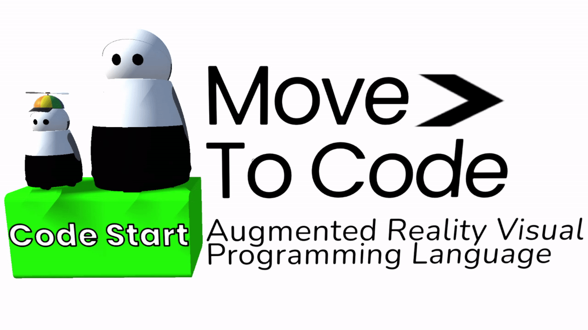

# MoveToCode: An Augmeted Reality Visual Programming Language


MoveToCode is an open source augmeted reality visual programming language (VPL) created by the [Interaction Lab](http://robotics.usc.edu/interaction/) led by [Maja J Matric](https://robotics.usc.edu/~maja/index.html). The VPL is used to study [student kinesthetic curiostiy](https://tgroechel.github.io/kin_cur.html).  The VPL can be thought of similar to [Scratch](https://scratch.mit.edu/) in 3D. 

MoveToCode is built for the [Microsoft Hololens 2](https://www.microsoft.com/en-us/hololens/hardware), as well as [ARCore supported mobile devices](https://developers.google.com/ar/devices), using the [Mixed Reality Toolkit](https://github.com/microsoft/MixedRealityToolkit-Unity). Currently it is set up to work with the [Mayfield Kuri robot](https://www.heykuri.com/explore-kuri/) but can be modified for any [ROS](https://www.ros.org/) supported robot via [ROS#](https://github.com/siemens/ros-sharp) and [rosbridge](http://wiki.ros.org/rosbridge_suite). A virtual, high fidelity model, Kuri robot is also currently availble with limited capabilities.

Doxygen documentation can be found here: https://interaction-lab.github.io/MoveToCode/html/index.html

## Videos/Gifs
- [MoveToCode + a robot tutor using the Hololens 2](https://www.youtube.com/watch?v=s7udZXa2wEw) - this is when students coded text based exercises. We have since moved to phone based AR coding a robot (video coming soon).

- MoveToCode mobile captured from the iPad's point of view. In pairs, students first build mazes out of physical pieces of paper. Once the mazes match, students program the smaller robot to complete these mazes. Students must move around to complete the above tasks presenting programming in a physically situated environment.

## Papers and Study Commits


[Augmented Reality Appendages for Robots: Design Considerations and Recommendations for Maximizing Social and Functional Perception](https://tgroechel.github.io/publications/appendages.pdf)
```
@inproceedings{goktan2022augmented,
  title={Augmented Reality Appendages for Robots: Design Considerations and Recommendations for Maximizing Social and Functional Perception},
  author={Goktan, Ipek and Ly, Karen and Groechel, Thomas Roy and Mataric, Maja},
  booktitle={5th International Workshop on Virtual, Augmented, and Mixed Reality for HRI},
  year={2022}
}
```


Commit for all papers below this: [0765f1d1ab46373f1bc1be90d9d5b07fafc2a533](https://github.com/interaction-lab/MoveToCode/commit/0765f1d1ab46373f1bc1be90d9d5b07fafc2a533)

[Kinesthetic Curiosity: Towards Personalized Embodied Learning with a Robot Tutor Teaching Programming in Mixed Reality](https://robotics.usc.edu/publications/media/uploads/pubs/pubdb_1110_b3d5df607edd4a42993486ba993c6bf7.pdf)
```
@InProceedings{10.1007/978-3-030-71151-1_22,
  author="Groechel, Thomas and Pakkar, Roxanna and Dasgupta, Roddur and Kuo, Chloe and Lee, Haemin and Cordero, Julia and Mahajan, Kartik and Matari{\'{c}}, Maja J.",
  editor="Siciliano, Bruno
  and Laschi, Cecilia
  and Khatib, Oussama",
  title="Kinesthetic Curiosity: Towards Personalized Embodied Learning with a Robot Tutor Teaching Programming in Mixed Reality",
  booktitle="Experimental Robotics",
  year="2021",
  publisher="Springer International Publishing",
  address="Cham",
  pages="245--252",
  isbn="978-3-030-71151-1"
}
```
[Adapting Usability Metrics for a Socially Assistive, Kinesthetic, Mixed Reality Robot Tutoring Environment (pdf)](https://robotics.usc.edu/publications/media/uploads/pubs/pubdb_1107_eff82bdefbf34f42a435be8c6bacbfa4.pdf)
```
@inproceedings{mahajan2020adapting,
  title={Adapting Usability Metrics for a Socially Assistive, Kinesthetic, Mixed Reality Robot Tutoring Environment},
  author={Mahajan, Kartik and Groechel, Thomas and Pakkar, Roxanna and Cordero, Julia and Lee, Haemin and Matari{\'c}, Maja J},
  booktitle={International Conference on Social Robotics},
  year={2020}
}
``` 

## External Dependencies
Versions of packages are pushed directly to the repository to avoid versioning issues, licensing permitting.
- [ROS#; dwhit UWP branch](https://github.com/dwhit/ros-sharp/commit/4ccf45fc94827132397afeaa210afc01834d1dec) ([Apache 2.0 License](http://www.apache.org/licenses/LICENSE-2.0))
    - [Newtonsoft.Json](https://github.com/JamesNK/Newtonsoft.Json) ([MIT License](https://en.wikipedia.org/wiki/MIT_License))
    - [Newtonsoft.Json.Bson](https://github.com/JamesNK/Newtonsoft.Json.Bson) ([MIT License](https://en.wikipedia.org/wiki/MIT_License))
    - [websocket-sharp](https://github.com/sta/websocket-sharp) ([MIT License](https://en.wikipedia.org/wiki/MIT_License))
- [Mixed Reality Toolkit v2.5](https://github.com/microsoft/MixedRealityToolkit-Unity)([MIT License](https://en.wikipedia.org/wiki/MIT_License))
- [NugetForUnity](https://github.com/GlitchEnzo/NuGetForUnity) ([MIT License](https://en.wikipedia.org/wiki/MIT_License))
- [Automatic Documentation Generation Unity Editor Plugin](http://www.jacobpennock.com/Blog/unity-automatic-documentation-generation-an-editor-plugin/) ([MIT License](https://en.wikipedia.org/wiki/MIT_License))

## Tested Platform Support
The following are currently tested versions of required software. Higher versions of each software may work but have not been tested.
- [Unity 3D](https://github.com/siemens/ros-sharp/tree/master/Unity3D) v2021.2.3f
- .NET Framework 4.6 and Visual Studio 2019/VS Code
- Built for:
  -  [Hololens 2](https://www.microsoft.com/en-us/hololens/hardware)
  -  [ARCore Supported Mobile Devices](https://developers.google.com/ar/devices)

## Licensing
MoveToCode is open source under the [MIT License](https://en.wikipedia.org/wiki/MIT_License)


## Questions or Contributions
For any questions, you can contact Thomas Groechel at groechel@usc.edu. Feel free to fork for your own projects and/or submit pull requests.
